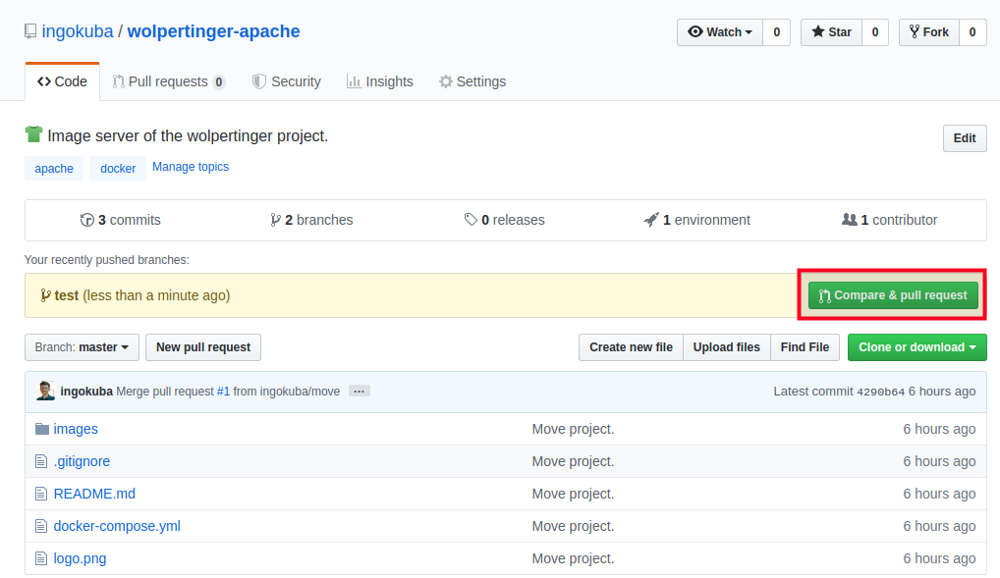

# How to add images with GitHub desktop

##### 1. Get [GitHub Desktop](https://desktop.github.com/)

##### 2. Checkout this project with HTTPS: https://github.com/ingokuba/wolpertinger-apache.git

##### 3. Create a new branch

##### 4. Add files

Make sure to put the new image(s) in `images/{new_image_name}` and name at least one `high`. (+ file ending)

You can also add `medium` and `low`.

##### 5. Commit these changes

Choose a useful title (1) and commit the changes to your branch (2).

##### 6. Push the branch

Publish the branch to the **internet**!

##### 7. Create a pull request (optionally)

Go to [https://github.com/ingokuba/wolpertinger-apache](https://github.com/ingokuba/wolpertinger-apache) and select `Compare & pull request`. Select the reviewers and click `Create pull request` and you are done!

